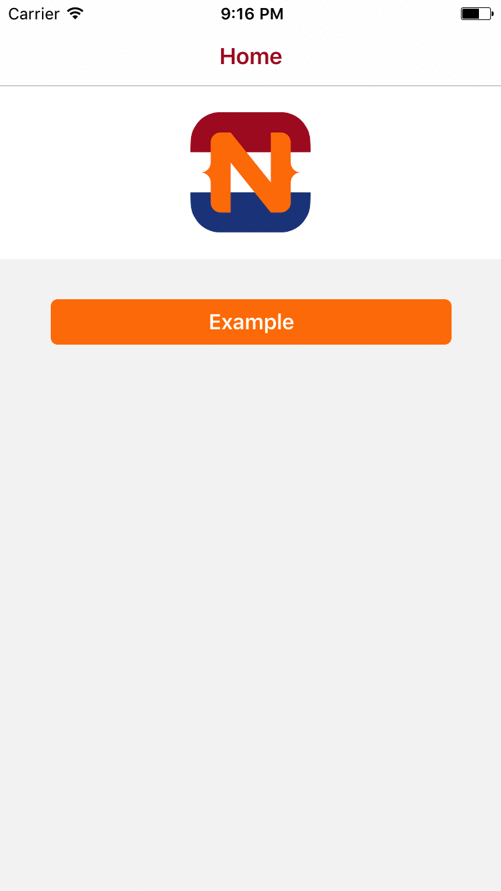

##Example of a NativeScript app with Couchbase and CryptoJS

For more information please refer to the article "[Encrypt data and store it in Couchbase with NativeScript](https://nativescript.nl/tips/encrypt-data-and-store-it-in-couchbase-with-nativescript/)" on the [NativeScript NL website](https://nativescript.nl).

####Instructions

```
git clone --depth 1 https://github.com/nativescriptnl/NSNL_Couchbase projectname
cd projectname
rm -rf .git
git init
npm install
tns platform add ios
tns livesync ios --watch
```


